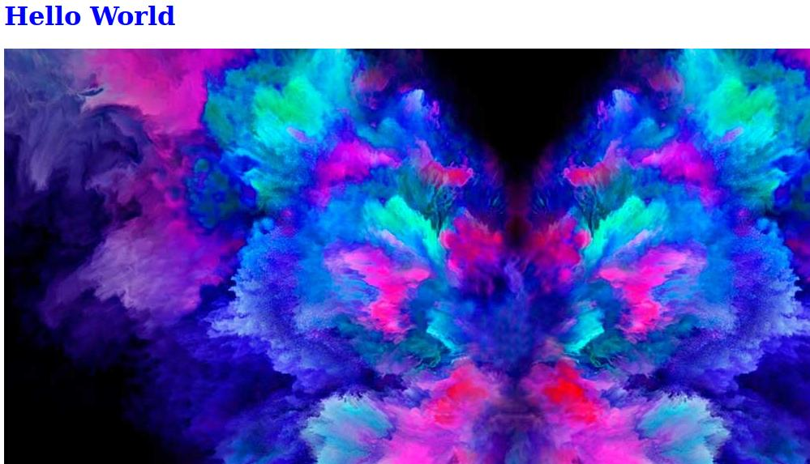

## Projecte Hello World
El projecte és una pàgina web amb un títol i una imatge.



Instruccions per descarregar i editar el codi:
```
git clone (repositori company)
(moure al directori)
git checkout -b (nom rama)
(modificar fitxer)
git commit -m "missatge"
git push origin (nom rama)
```
